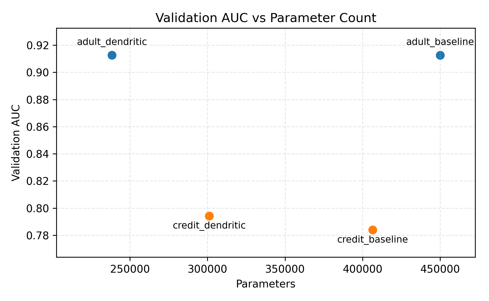
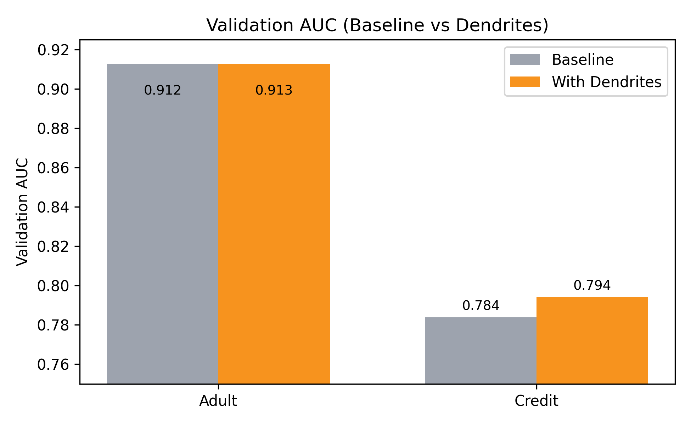
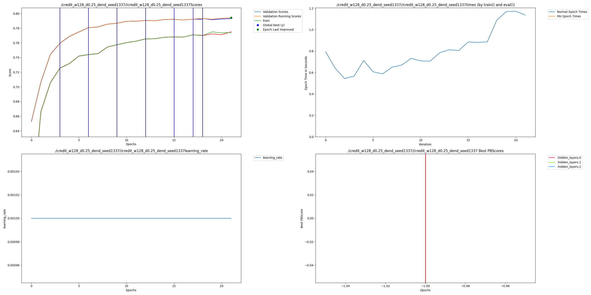

# Adult & Credit Tabular Compression with Dendrites

**Goal:** I wanted to show that AI dendrites can shrink tabular MLPs on two separate UCI datasets (Adult Income & Credit Default) without losing AUC.

## What’s inside this folder?
- `train.py` – single entry point with dataset flag, dendrite toggles, and logging utilities.
- `run_sweep.py` / `Makefile` – helper shortcuts for the adult runs.
- `metrics.py`, `param_count.py`, `test_setup.py` – light utilities for metrics, parameter counting, and smoke testing.
- `results/` – CSVs, Google-Sheets-style comparison chart, and the final PAI graph.
- `credit_w128_d0.25_dend_seed1337/` – saved checkpoints + the raw `/PAI/*.png` bundles produced by Perforated AI.

## Installation
```bash
pip install -r Examples/baseExamples/adult_credit_dendrites/requirements.txt
```

## Running the experiments
All commands assume repo root. (Optional) Set `MPLCONFIGDIR` to avoid font-cache warnings on macOS:
```bash
export MPLCONFIGDIR="$(pwd)/Examples/baseExamples/adult_credit_dendrites/results"
```

### 1. Adult Income baseline (≈450k params)
```bash
python Examples/baseExamples/adult_credit_dendrites/train.py \
  --epochs 40 --patience 6 \
  --width 512 --dropout 0.25 \
  --no-dendrites \
  --notes baseline_w512
```

### 2. Adult Income dendritic (≈238k params)
```bash
python Examples/baseExamples/adult_credit_dendrites/train.py \
  --epochs 60 --patience 10 \
  --width 128 --dropout 0.25 \
  --use-dendrites --exclude-output-proj \
  --max-dendrites 12 --fixed-switch-num 3 \
  --notes pai_w128_cap12
```

### 3. Credit Default baseline
```bash
python Examples/baseExamples/adult_credit_dendrites/train.py \
  --dataset credit \
  --epochs 40 --patience 6 \
  --width 512 --dropout 0.25 \
  --no-dendrites \
  --notes credit_baseline_w512
```

### 4. Credit Default dendritic 
```bash
python Examples/baseExamples/adult_credit_dendrites/train.py \
  --dataset credit \
  --epochs 60 --patience 10 \
  --width 128 --dropout 0.25 \
  --use-dendrites --exclude-output-proj \
  --max-dendrites 8 --fixed-switch-num 3 \
  --seed 1337 \
  --notes credit_dend_w128_cap8_seed1337
```

### Optional: seed sweep helper
```bash
for seed in 17 23 42 1337 2025; do
  python Examples/baseExamples/adult_credit_dendrites/train.py \
    --dataset credit --epochs 60 --patience 12 \
    --width 128 --dropout 0.25 \
    --use-dendrites --exclude-output-proj \
    --max-dendrites 8 --fixed-switch-num 3 \
    --seed $seed \
    --notes "credit_dend_w128_cap8_seed${seed}"
done
```
Seed 1337 provided the best no-loss trade-off; keep that row in `results/best_test_scores.csv` after sweeping.

### Smoke test
```bash
python Examples/baseExamples/adult_credit_dendrites/test_setup.py
```

## Datasets
- **Adult Income** (`phpMawTba.arff`): pulled automatically from OpenML (`adult`, version 2). The script caches it under `data_cache/openml/`.
- **Default of Credit Card Clients** (`default of credit card clients.arff`): also fetched via OpenML (ID 42477). If network is disabled, download the ARFF manually, drop it into `data_cache/openml/`, and rerun the commands above.

## Outcomes

Validation AUC vs parameter count for the four headline runs:



### Baseline vs Dendrites bar chart



### Final PAI graph
The Perforated AI tracker now emits the standard `/PAI/*.png`. Below is the exact `PAI.png` from the winning credit dendritic run:



## Results summary
Dataset | Model | Params | Δ vs Baseline | Val AUC | Test AUC | Notes
---|---|---|---|---|---|---
Adult | Vanilla MLP (w=512) | 450,049 | — | 0.9125 | 0.9159 | `baseline_w512`
Adult | Dendritic MLP (w=128) | 238,465 | −47% | 0.9125 | 0.9164 | `pai_w128_cap12`
Credit | Vanilla MLP (w=512) | 406,529 | — | 0.7839 | 0.7726 | `credit_baseline_w512`
Credit | Dendritic MLP (w=128, seed 1337) | 301,185 | −26% | 0.7955 | 0.7810 | `credit_dend_w128_cap8_seed1337`

`results/best_test_scores.csv` stores the same table and is what `quality_vs_params.png` reads from. `results/inference_bench.csv` holds throughput numbers, and `results/params_progression.csv` logs dendrite growth over time.

## Tips & troubleshooting
- Change `--max-dendrites` / `--fixed-switch-num` to explore other compression targets. Everything is logged so you can audit each restructure.
- For offline usage, copy the two ARFFs into `data_cache/openml/`; the loader automatically prefers local files.
- Every dendritic run now emits the standard Perforated AI plot bundle. 
- Use `make sweep` to recreate the adult baseline+dendritic pair in one go.
